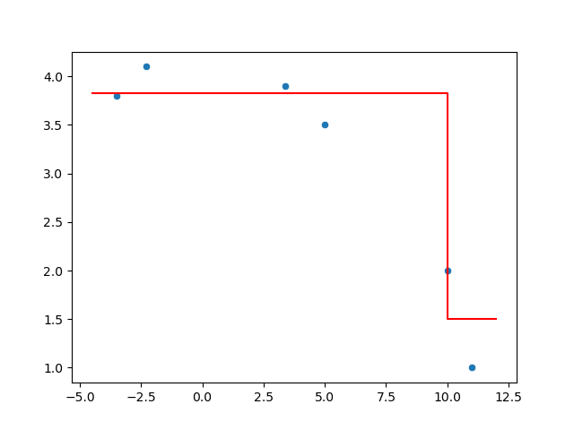
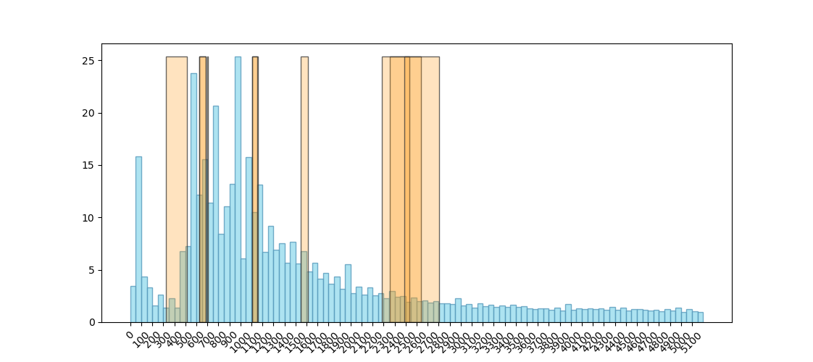

# test-task

## Задание 2 
```
python approx.py
```

```
Enter points number : 6
Enter points values : x, y
#1 : -2.3,4.1
#2 : -3.5,3.8
#3 : 5,3.5
#4 : 3.4,3.9
#5 : 10,2
#6 : 11,1
----------------------------------------
a = 3.8249999999999997
b = 1.5
c = 10.0
```



## Задание 3

```
python ltv.py -n 10 --draw_graph --print_log --delta 0.001
```

```
Target mean count = 10, delta = 0.001
-------------------------
((left, right), mean)
-------------------------
((624, 683.98), 10.0)
((1546, 1615.49), 10.0)
((2356, 2640.03), 10.0)
((2284, 2536.17), 10.0)
((698, 705.79), 10.0)
((1108, 1158.88), 10.0)
((624, 683.98), 10.0)
((1104, 1150.34), 10.0)
((322, 515.54), 10.0)
((2487, 2804.0), 10.0)
-------------------------
```


